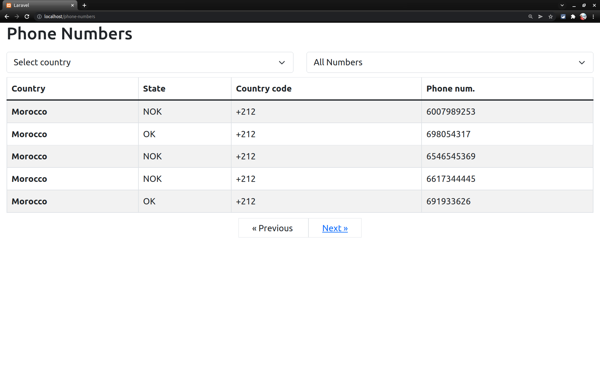
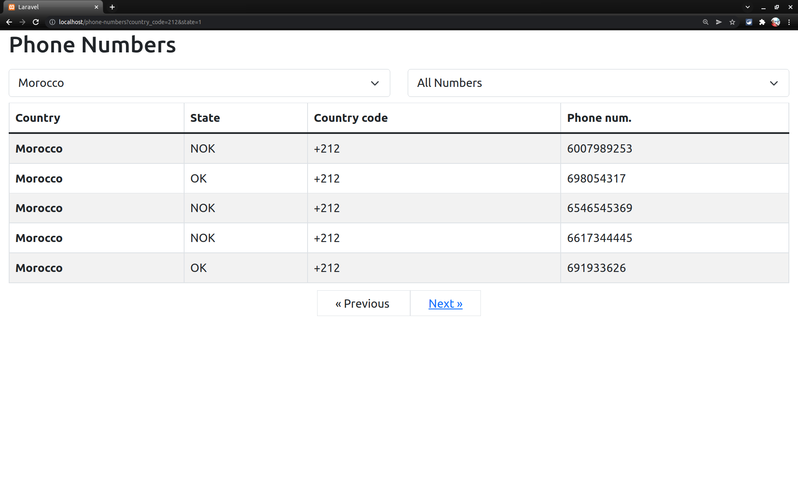
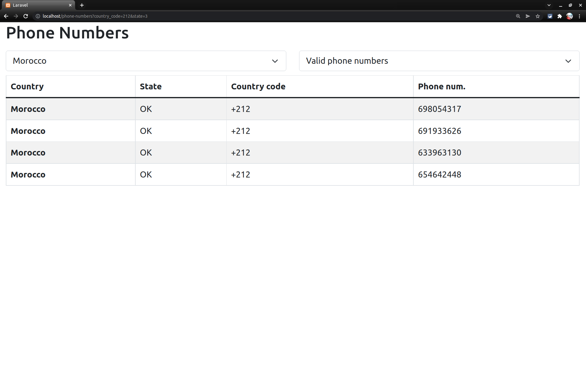
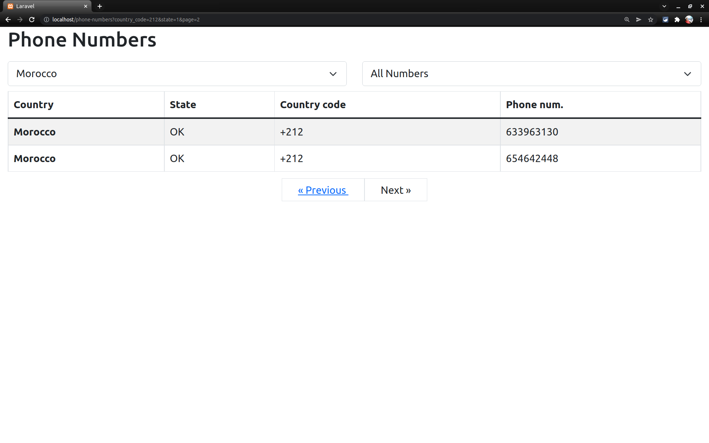
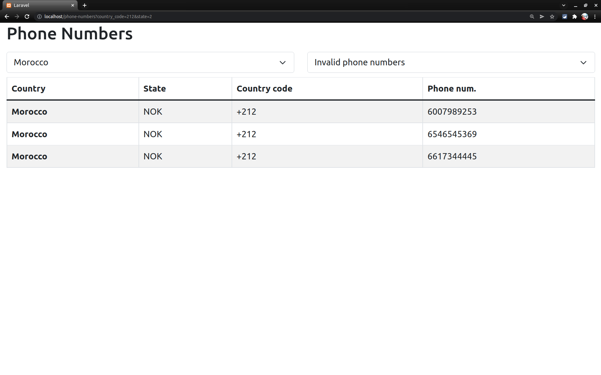

## Idea

Create a single page application that uses the database provided (SQLite 3) to list and
categorize country phone numbers.
Phone numbers should be categorized by country, state (valid or not valid), country code and
number.
The page should render a list of all phone numbers available in the DB. It should be possible to
filter by country and state. Pagination is an extra.

## Tools and technologies

- Laravel PHP 8
- Bootstrap 5
- Javascript
- Docker and docker composer

## Installation
- Clone the project
- Open terminal then do the following
```
cp .env.example .env
docker compose up
docker-compose exec web /bin/bash
# then do the following in ssh opened from previous command
composer install
php artisan key:generate
```
Open http://testing.local or simple http://localhost/

## Demo images






